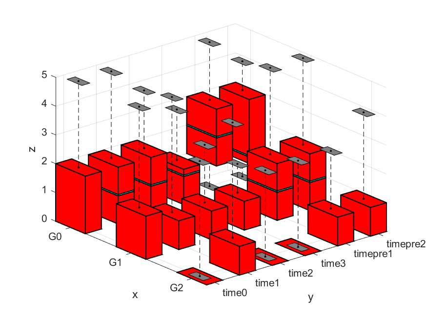

## 3D Box Plot

### matlab version

This MATLAB script `main.m` and its supporting function `boxPlot3D_.m` are used to generate a 3D box plot visualization from a dataset stored in a CSV file. The 3D box plot provides insights into the distribution of data across multiple dimensions, making it useful for visualizing complex datasets.

#### Usage
1. **Data Reading**: The script reads data from a CSV file named `datacsv`.
2. **Data Dimension Definition**: The script defines the dimensions of the data, including group values and time values.
3. **View Parameters**: Parameters such as azimuth (`az`) and elevation (`el`) angles control the viewing perspective of the 3D plot.
4. **Data Filtering**: Data is filtered based on group and time values. (or based on your only need)

#### File Structure
- **`main.m`**: Main script for data processing and visualization.
- **`boxPlot3D_.m`**: Supporting function for generating the 3D box plot.

#### Function Parameters
- **`box_factor`**: Box size scaling factor.
- **`az`**: Azimuth angle for viewing perspective.
- **`el`**: Elevation angle for viewing perspective.
- **`xLabels`**: Labels for x-axis.
- **`yLabels`**: Labels for y-axis.

### python version

This Python script generates a 3D box plot visualization of pain scores over time using Plotly.
